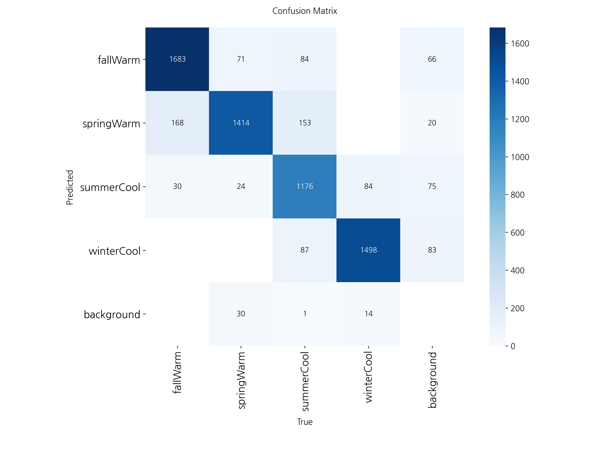

# 🎨 WarmCoolYolo - YOLO 기반 퍼스널 컬러 분류 모델

## 📌 프로젝트 개요

이 프로젝트는 YOLOv11-CLS 모델을 기반으로 사용자의 얼굴 이미지에서 **퍼스널 컬러(웜톤/쿨톤)** 를 분류하는 딥러닝 모델을 개발하는 것을 목표로 합니다. Roboflow를 통해 데이터를 수집 및 관리하고, Ultralytics 라이브러리를 통해 모델을 학습 및 평가합니다.

향후 FastAPI를 이용한 API 서버 개발, Unity 기반 AR 가상 메이크업 기능, 커뮤니티 기능(Photon Engine 연동) 등으로 확장할 계획입니다.

---

## 🏗 시스템 구성

프로젝트는 다음 다섯 개의 주요 리포지토리로 구성되어 있습니다:

### 1. [WarmCoolYolo](https://github.com/anyoungjin20040106/WarmCoolYolo)

- YOLO12 기반 퍼스널 컬러 분류 모델
- Roboflow를 통한 데이터셋 관리
- 모델 학습 및 평가 파이프라인

### 2. [WarmCoolFastapi](https://github.com/anyoungjin20040106/WarmCoolFastapi)

- FastAPI 기반 백엔드 서버
- YOLOv12 모델 서빙
- RESTful API 엔드포인트 제공
- Postgresql 데이터베이스 연동

### 3. [WarmCoolUnity](https://github.com/anyoungjin20040106/WarmCoolUnity)

- Unity 기반 AR 애플리케이션
- ARFoundation을 통한 얼굴 인식
- 가상 메이크업 적용
- Photon 기반 실시간 채팅

### 4. [WarmCoolSQL](https://github.com/anyoungjin20040106/WarmCoolSQL)

- 채팅 정보 관리
- 유저 정보 관리
- 퍼스널 컬러 해설

### 5. [WarmCoolDataset](https://github.com/anyoungjin20040106/WarmCoolDataset)

- roboflow를 활용한 데이터 수집
- github를 활용한 데이터 수집
- 데이터 라벨링

---

## 🗂 모델 성능 평가

### 1학기

    

    **최고 성능 모델:** `runs/classify/train6/weights/best.pt` (정확도: 91%)

### 2학기

    

| 계절 | 재현율            | 정밀도            |
| ---- | ----------------- | ----------------- |
| 봄   | 0.894736842105263 | 0.883928571428571 |
| 여름 | 0.918778427550357 | 0.805698005698006 |
| 가을 | 0.783477681545636 | 0.846652267818574 |
| 겨울 | 0.93859649122807  | 0.898081534772182 |
| 평균 | 0.883897360607332 | 0.858590094929333 |

**최고 성능 모델:** `runs/detect/train2/weights/best.pt` (정확도: 0.853571956811123%)

---

## 🛠 사용 기술

### 1학기
- [-111F68?style=flat&logo=Ultralytics&logoColor=white)](https://docs.ultralytics.com/ko/tasks/classify/)

### 2학기
- [-111F68?style=flat&logo=Ultralytics&logoColor=white)](https://docs.ultralytics.com/ko/models/yolo12/)
